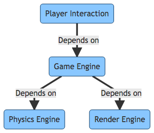

# Design Doc
This document aims to provide a place that enables discussion of the design of the game, and the physic engine underlying.

## Proposed Design
This is the proposed design, current design is becoming harder to maintain, it occupies too much cognitive load. So my next priority is to refactor the code to the new proposed design:

## Current Design
### Class Diagram
The following diagram shows current class design:

### User Interaction Diagram
The following diagram shows how player action propagate into the game:

### Rendering flow
The following diagram describes how render happens:

